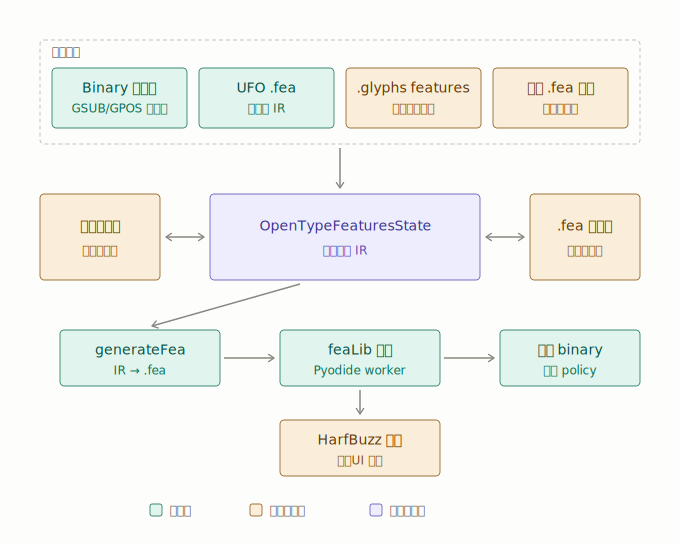

# OpenType feature：現況盤點與目標架構

這份文件記錄 2026-07 對 OpenType feature 子系統的全面盤點結果、目標架構與施工順序。
資料模型與反組譯工作流的深入筆記見 [OpenType feature 工作流](opentype-feature-workflow.md)；
本文件回答的是「還缺什麼、往哪裡走、先做什麼」。

## 現況盤點（2026-07）

### 資料層：成熟

- **Binary 反編譯**（`src/lib/openTypeFeatures/extractBinaryFeatures.ts` 與各
  `gsub*` / `gpos*` / `gdefParser`）：自製二進位解析器，GSUB type 1–8、GPOS
  type 1–9 全部支援，contextual / chaining 三種 format 齊全，extension lookup
  解包成等效 rules，巢狀 lookup 引用完整保留。解析不了的 lookup 降級為
  `unsupportedLookups` 並配合 `preserve-if-unchanged` 匯出策略。
- **IR**（`src/lib/openTypeFeatures/types.ts` 的 `OpenTypeFeaturesState`）：
  lookup 為全域扁平清單、feature 只存引用，支援 named lookup 跨 feature 重用、
  完整 lookupflag、mark/cursive positioning、GDEF。雙軌 source-of-truth
  （`rawFeatureText` + `sourceSections` 的 preservationPolicy）。
- **編譯管線**：IR → `generateFea()` → Pyodide worker 跑 fontTools feaLib →
  binary export，三種 export policy，錯誤可經 source map 回映 IR record。
- **HarfBuzz shaping**（`shapeTextWithHarfBuzz.ts`）：runtime 完整、支援
  feature on/off，**但目前沒有任何 UI 消費者**。

### 資料層缺口

| 缺口                                                       | 影響                                                                    | 優先序                 |
| ---------------------------------------------------------- | ----------------------------------------------------------------------- | ---------------------- |
| `rawFeatureText` 是單一 blob                               | 撐不起 per-feature 編輯／filter UX，也接不上 Glyphs 的 per-feature 模型 | 高（是後續 UI 的地基） |
| FeatureParams 未實作                                       | ss01–ss20 UI 名稱、cv01–cv99 參數、size feature 匯入即遺失              | 高                     |
| lookupflag 的 MarkAttachmentType（高位元組）未解析         | IR 欄位已存在，extractor 沒填                                           | 高（成本低）           |
| `.glyphs` 的 features / featurePrefixes 不進 IR            | 只有字串 round-trip，不出現在 feature 面板                              | 高                     |
| legacy `kern` 表不轉 GPOS                                  | 老 TTF 的 kerning 會漏                                                  | 中                     |
| FeatureVariations（rvrn）不重建                            | 只保留 raw bytes；可等 variable font 支援一起做                         | 低                     |
| ValueRecord device / variation table、contour-point anchor | 同上，variable font 前不急                                              | 低                     |

### UI 層：落後於資料層

- Feature UI 藏在 Font Settings modal 的 OpenType tab（master-detail
  workbench）。瀏覽結構良好（outline 側欄已有 per-feature 清單），但**幾乎全部
  唯讀**；唯一可編輯的是無高亮的 raw `.fea` `Textarea`。
- 視覺化 rule 編輯的 helper（`utils/ruleEditorState.ts`、
  `utils/valueRecordState.ts`）已寫好但**無人 import**（死碼，待接線）。
- HarfBuzz shaping 預覽：管線零件齊全，UI 完全沒接。
- 成熟的視覺化編輯散在別處：編輯器右側 Behaviors panel（glyph 中心）與
  Kerning panel，與 feature workbench 概念割裂。

## 目標架構

### 原則

延續 [工作流文件](opentype-feature-workflow.md#原則) 的既有原則，再加上：

1. **IR 是唯一權威，`.fea` 文字是 IR 的投影（projection）**。例外是使用者明確
   標記為「手寫、不解析」的 manual snippet——那些以原文為權威、原樣進出。
2. **原文軌的粒度是 per-feature / per-prefix snippet，不是整份文字**。對齊
   Glyphs 的 `features` + `featurePrefixes` 模型。這同時解決三件事：
   `.glyphs` 匯入可一一對應、UI 能做 per-feature code 編輯與 filter、手動
   `.fea` 掛載可按 block 管理。
3. **每個 snippet 有明確的權威狀態**：可完整 classify 進 IR → IR 權威，
   `.fea` 視圖顯示 `generateFea` 投影；classify 失敗 → 降級為原文權威並明確
   標示（現有 `sourceSections` 機制已能表達這個狀態機）。

### UI：獨立的 feature workspace

把 OpenType feature 從 settings modal 升格為一級工作區（與 kerning 同級），
三欄式：

1. **左欄：feature 側欄**（由現有 `OpenTypeOutline` 演化）——per-feature
   列表、啟用開關、拖曳排序、來源 badge（auto / manual / imported）、
   diagnostics 計數。即 Glyphs 式的特性分離與 filter。
2. **中欄：per-feature 雙模式編輯**——每個 feature 可切換「視覺 rule 卡片」
   與「`.fea` code」：
   - 視覺模式：接上 `ruleEditorState` / `valueRecordState`，從 single /
     ligature substitution 與 pair positioning 開始，contextual 最後做。
   - Code 模式：CodeMirror 6（輕量、適合純前端）+ 自寫 `.fea` 語法高亮；
     編譯錯誤經現成 source map（`compilerErrorMapping.ts`）inline 標紅。
3. **底部：HarfBuzz 即時預覽條**——文字輸入 + feature toggle chips +
   before/after 對照。管線：IR → `generateFea` → feaLib worker（debounced）
   → HarfBuzz shape → 渲染。零件全部現成，只差組裝。

手動 `.fea` 掛載：workspace 提供「attach `.fea` 檔案」入口，按 block 切分成
manual snippets（可整份維持原文權威，也可逐 block 升級為 IR 管理），對應
`FeatureSourceSection` 的 `manual-fea` kind。

Behaviors panel（glyph 中心）與 feature workspace（feature 中心）是同一 IR
的兩個視角，**不合併**；補上互相跳轉即可。

## 施工順序

1. **資料層收尾**（動 IR schema，越晚做遷移成本越高）——**已完成（2026-07）**
   1. ✅ lookupflag `MarkAttachmentType` 解析：GDEF `MarkAttachClassDef` 提升為
      `gdef.markAttachClasses` glyph classes，flag 高位元組對應到
      `markAttachmentClassId`。同時修正 `markFilteringSetClassId` 指向
      `gdef_mark_glyph_set_N`，並停止輸出非法的 `MarkGlyphSetsDef` FEA 語法
      （feaLib 不接受；mark glyph sets 改由 `lookupflag UseMarkFilteringSet`
      重建）。
   2. ✅ FeatureParams：binary 反編譯（含 name table 解析
      `nameTableParser.ts`）、IR `FeatureRecord.featureParams`、`generateFea`
      輸出 featureNames / cvParameters / size parameters、raw classifier 支援
      對應語法（`rawFeatureParamsParser.ts`；帶平台 ID 的 name 陳述式保守維持
      原文權威）。
   3. ✅ `rawFeatureText` → per-feature / per-prefix snippets
      （`rawFeatureSnippets.ts`）：snippets 為儲存權威，舊 blob 於載入時遷移
      （`normalizeRawFeatureSnippets`，掛在 kumikoFontDataAdapter）；分類目前
      仍以 join 後的整段文字進行（per-snippet 分類是後續增強，不動 schema）。
      snippet 支援 `disabled`（排除於分類與 generated FEA，但保留原文）。
   4. ✅ `.glyphs` features / featurePrefixes / classes 接進 IR
      （`glyphsFeatures.ts`）：匯入轉為 snippets（feature 加 wrapper、class 轉
      `@Name = [...]`）並走 classify；匯出時 snippets 反向重建三個欄位，
      automatic / disabled / notes 經 snippet meta round-trip。
   - 注意：`src/lib/project/persistence.ts` 目前 DB 升級是砍掉重建；本輪
     schema 變更皆為 additive + 載入時遷移，尚未需要 DB migration 策略，
     但正式化前仍應確定。
2. **HarfBuzz 預覽接上 UI**——零件齊全、最快見效，且後續每步編輯 UI 都有即時
   回饋可驗證。
3. **Feature workspace**——獨立入口 + 三欄布局 + CodeMirror。
4. **視覺 rule 編輯器**——接上既有 helper，由簡入繁。
5. **Behaviors panel 整合**——互相跳轉，不合併。

## 已知順手債

- `FontSettingsModal.tsx:44` tab 標籤硬編碼中文陣列未走 i18n。
- `BehaviorsPanel.tsx:120` toast 硬編碼中文。
- Kerning 字對預覽用 unicode 字元 fallback（`□`），非 shaped glyph——預覽條
  落地後可共用同一管線。
