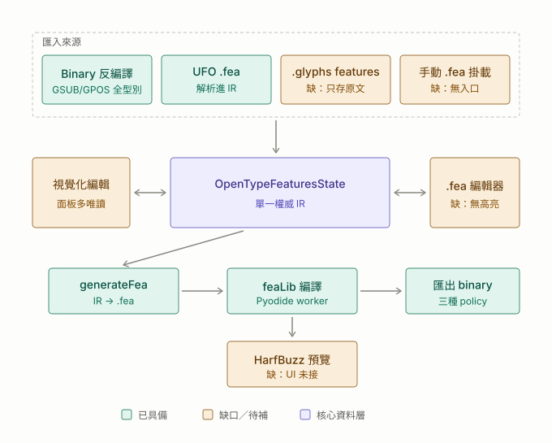

# OpenType feature：現況盤點與目標架構

這份文件記錄 2026-07 對 OpenType feature 子系統的全面盤點結果、目標架構與施工順序。
資料模型與反組譯工作流的深入筆記見 [OpenType feature 工作流](opentype-feature-workflow.md)；
本文件回答的是「還缺什麼、往哪裡走、先做什麼」。

## 現況盤點（2026-07）

### 資料層：成熟

- **Binary 反編譯**（`src/lib/openTypeFeatures/extractBinaryFeatures.ts` 與各
  `gsub*` / `gpos*` / `gdefParser`）：自製二進位解析器，GSUB type 1–8、GPOS
  type 1–9 全部支援，contextual / chaining 三種 format 齊全，extension lookup
  解包成等效 rules，巢狀 lookup 引用完整保留。解析不了的 lookup 降級為
  `unsupportedLookups` 並配合 `preserve-if-unchanged` 匯出策略。
- **IR**（`src/lib/openTypeFeatures/types.ts` 的 `OpenTypeFeaturesState`）：
  lookup 為全域扁平清單、feature 只存引用，支援 named lookup 跨 feature 重用、
  完整 lookupflag、mark/cursive positioning、GDEF。雙軌 source-of-truth
  （`rawFeatureText` + `sourceSections` 的 preservationPolicy）。
- **編譯管線**：IR → `generateFea()` → Pyodide worker 跑 fontTools feaLib →
  binary export，三種 export policy，錯誤可經 source map 回映 IR record。
- **HarfBuzz shaping**（`shapeTextWithHarfBuzz.ts`）：runtime 完整、支援
  feature on/off，**但目前沒有任何 UI 消費者**。

### 資料層缺口

| 缺口                                                       | 影響                                                                    | 優先序                 |
| ---------------------------------------------------------- | ----------------------------------------------------------------------- | ---------------------- |
| `rawFeatureText` 是單一 blob                               | 撐不起 per-feature 編輯／filter UX，也接不上 Glyphs 的 per-feature 模型 | 高（是後續 UI 的地基） |
| FeatureParams 未實作                                       | ss01–ss20 UI 名稱、cv01–cv99 參數、size feature 匯入即遺失              | 高                     |
| lookupflag 的 MarkAttachmentType（高位元組）未解析         | IR 欄位已存在，extractor 沒填                                           | 高（成本低）           |
| `.glyphs` 的 features / featurePrefixes 不進 IR            | 只有字串 round-trip，不出現在 feature 面板                              | 高                     |
| legacy `kern` 表不轉 GPOS                                  | 老 TTF 的 kerning 會漏                                                  | 中                     |
| FeatureVariations（rvrn）不重建                            | 只保留 raw bytes；可等 variable font 支援一起做                         | 低                     |
| ValueRecord device / variation table、contour-point anchor | 同上，variable font 前不急                                              | 低                     |

### UI 層：落後於資料層

- Feature UI 藏在 Font Settings modal 的 OpenType tab（master-detail
  workbench）。瀏覽結構良好（outline 側欄已有 per-feature 清單），但**幾乎全部
  唯讀**；唯一可編輯的是無高亮的 raw `.fea` `Textarea`。
- 視覺化 rule 編輯的 helper（`utils/ruleEditorState.ts`、
  `utils/valueRecordState.ts`）已寫好但**無人 import**（死碼，待接線）。
- HarfBuzz shaping 預覽：管線零件齊全，UI 完全沒接。
- 成熟的視覺化編輯散在別處：編輯器右側 Behaviors panel（glyph 中心）與
  Kerning panel，與 feature workbench 概念割裂。

## 目標架構

### 原則

延續 [工作流文件](opentype-feature-workflow.md#原則) 的既有原則，再加上：

1. **IR 是唯一權威，`.fea` 文字是 IR 的投影（projection）**。例外是使用者明確
   標記為「手寫、不解析」的 manual snippet——那些以原文為權威、原樣進出。
2. **原文軌的粒度是 per-feature / per-prefix snippet，不是整份文字**。對齊
   Glyphs 的 `features` + `featurePrefixes` 模型。這同時解決三件事：
   `.glyphs` 匯入可一一對應、UI 能做 per-feature code 編輯與 filter、手動
   `.fea` 掛載可按 block 管理。
3. **每個 snippet 有明確的權威狀態**：可完整 classify 進 IR → IR 權威，
   `.fea` 視圖顯示 `generateFea` 投影；classify 失敗 → 降級為原文權威並明確
   標示（現有 `sourceSections` 機制已能表達這個狀態機）。

### UI：獨立的 feature workspace

把 OpenType feature 從 settings modal 升格為一級工作區（與 kerning 同級），
三欄式：

1. **左欄：feature 側欄**（由現有 `OpenTypeOutline` 演化）——per-feature
   列表、啟用開關、拖曳排序、來源 badge（auto / manual / imported）、
   diagnostics 計數。即 Glyphs 式的特性分離與 filter。
2. **中欄：per-feature 雙模式編輯**——每個 feature 可切換「視覺 rule 卡片」
   與「`.fea` code」：
   - 視覺模式：接上 `ruleEditorState` / `valueRecordState`，從 single /
     ligature substitution 與 pair positioning 開始，contextual 最後做。
   - Code 模式：CodeMirror 6（輕量、適合純前端）+ 自寫 `.fea` 語法高亮；
     編譯錯誤經現成 source map（`compilerErrorMapping.ts`）inline 標紅。
3. **底部：HarfBuzz 即時預覽條**——文字輸入 + feature toggle chips +
   before/after 對照。管線：IR → `generateFea` → feaLib worker（debounced）
   → HarfBuzz shape → 渲染。零件全部現成，只差組裝。

手動 `.fea` 掛載：workspace 提供「attach `.fea` 檔案」入口，按 block 切分成
manual snippets（可整份維持原文權威，也可逐 block 升級為 IR 管理），對應
`FeatureSourceSection` 的 `manual-fea` kind。

Behaviors panel（glyph 中心）與 feature workspace（feature 中心）是同一 IR
的兩個視角，**不合併**；補上互相跳轉即可。

## 施工順序

1. **資料層收尾**（動 IR schema，越晚做遷移成本越高）——**已完成（2026-07）**
   1. ✅ lookupflag `MarkAttachmentType` 解析：GDEF `MarkAttachClassDef` 提升為
      `gdef.markAttachClasses` glyph classes，flag 高位元組對應到
      `markAttachmentClassId`。同時修正 `markFilteringSetClassId` 指向
      `gdef_mark_glyph_set_N`，並停止輸出非法的 `MarkGlyphSetsDef` FEA 語法
      （feaLib 不接受；mark glyph sets 改由 `lookupflag UseMarkFilteringSet`
      重建）。
   2. ✅ FeatureParams：binary 反編譯（含 name table 解析
      `nameTableParser.ts`）、IR `FeatureRecord.featureParams`、`generateFea`
      輸出 featureNames / cvParameters / size parameters、raw classifier 支援
      對應語法（`rawFeatureParamsParser.ts`；帶平台 ID 的 name 陳述式保守維持
      原文權威）。
   3. ✅ `rawFeatureText` → per-feature / per-prefix snippets
      （`rawFeatureSnippets.ts`）：snippets 為儲存權威，舊 blob 於載入時遷移
      （`normalizeRawFeatureSnippets`，掛在 kumikoFontDataAdapter）；分類目前
      仍以 join 後的整段文字進行（per-snippet 分類是後續增強，不動 schema）。
      snippet 支援 `disabled`（排除於分類與 generated FEA，但保留原文）。
   4. ✅ `.glyphs` features / featurePrefixes / classes 接進 IR
      （`glyphsFeatures.ts`）：匯入轉為 snippets（feature 加 wrapper、class 轉
      `@Name = [...]`）並走 classify；匯出時 snippets 反向重建三個欄位，
      automatic / disabled / notes 經 snippet meta round-trip。
   - 注意：`src/lib/project/persistence.ts` 目前 DB 升級是砍掉重建；本輪
     schema 變更皆為 additive + 載入時遷移，尚未需要 DB migration 策略，
     但正式化前仍應確定。
2. **HarfBuzz 預覽接上 UI**——**已完成（2026-08）**。`ShapingPreviewBar`
   掛在 OpenType tab／workspace 底部：文字輸入 + feature toggle chips +
   關閉/套用對照。管線：canonical → `exportFontAsBinary('ttf')`（feaLib
   worker 編譯）→ `shapeTextWithHarfBuzz`（`includeGlyphShapes` 直接從編譯
   後的字型取 glyph 名稱與外框）→ `ShapedRunSvg` 渲染。編譯結果以
   state identity 快取（`shapingPreviewFont.ts`），打字不重編譯。
   順帶修掉一個真 bug：CJK family name 會被 opentype.js 原樣寫進 CFF Name
   INDEX / PostScript name，fontTools 讀回直接炸（`'ascii' codec can't
decode`）——`toPostScriptFontName` 在匯出層消毒（`fontBinaryFormat.ts`）。
3. **Feature workspace**——**已完成並依 UI 討論重構為「預覽為中心」（2026-08）**。
   首頁是大型整形預覽（橫排/直排一級切換）：點任一輸出字形，右側 trace
   面板顯示它經過的規則鏈（`traceShaping.ts` 走 harfbuzzjs `shapeWithTrace`
   的 per-lookup buffer diff，訊息自帶 feature tag；`traceRuleLookup.ts` 映回
   IR rule 供「編輯規則」跳轉，另可跳字形編輯器）。預覽輸入支援
   `/glyphName` 逃逸語法（`shapingPreviewTokens.ts`，U+FFFC 佔位、整形後換
   成指定字形——token 字形刻意不參與替換）。「特性總覽」是 specimen
   sheet：每個 feature 用自己的規則選樣 before→after（`useFeatureSpecimens`），
   附啟用開關（`featureEnablement.ts` 同步 IR isActive 與 snippet disabled）
   與 auto-suggestion 入口。規則的字形欄位一律配字形挑選器
   （`GlyphPickerPopover`，同基底變體優先），大規模 feature（>100 條）預設
   虛擬化規則表（`RuleTableView`，kern 值可就地編輯）。原文接續：`WorkspaceView` 增加
   `'features'`，`FeatureWorkspaceScreen` 為一級畫面（入口在
   ProjectControlActions），直接寫入 store（`updateFontSettings` → dirty →
   auto draft save），不再是 modal-local draft。`.fea` 編輯改用 CodeMirror 6
   （`FeaCodeEditor` + 自寫 `feaLanguage` StreamLanguage 高亮），預覽編譯
   失敗經 `parseCompilerErrorLocations` 以行號 inline 標紅在 generated FEA
   視圖。
4. **視覺 rule 編輯器**——**已完成第一階段（2026-08）**。per-feature 雙模式
   （視覺規則 / FEA 程式碼），`FeatureRuleEditor` 接上 `ruleEditorState` 與
   `valueRecordState`：single/ligature substitution 與 pair positioning 可
   直接編輯（selector 支援 `@ClassName`），其餘 rule kind 唯讀降級提示。
   contextual 等複雜 kind 仍待後續。

### 家族化檢視與 kern 資料層（2026-08，UI 討論第二輪）

「不同特性需要不同檢視」以 lookup 家族落地，而非 per-tag 面板：

- **kern 資料層**：`fontData.kerningPairs/kerningGroups`（kerning.plist 模型）
  此前完全不進二進位匯出與預覽。現在 `synthesizeKerning.ts` 在每次編譯時
  將其合成為 kern feature（`compileManagedFontFeatures` 第三參數；variable
  build 亦接線，per-master 或合併後擇一）。IR kern 已涵蓋的字對自動略過以免
  加倍；`preserve-compiled-layout-tables` 政策下不注入。kern auto-suggestion
  因此退場。Pyodide 回歸測試：`kerningCompileRuntime.test.ts`。
- **kern 字對工作檯**（`KernPairView`）：kerningPairs 的投影——虛擬化字對表、
  值就地編輯（走既有 kerning actions）、選取列以目前字型即時 before/after
  對照；匯入的 GPOS kern 另列並可跳規則表。
- **對照網格**（`SubstitutionGridView`）：一對一替換家族（vert/ssXX…）的
  proof sheet，class 展開成員、缺字形標示、點格開字形編輯器；singleSub 為主
  的 feature 預設此檢視，detail 共四模式（視覺規則/對照網格/規則表/FEA）。
- **語言系統選擇器**：`shapingLanguage.ts` 將 languagesystems 的 OT tag 映射
  到 HarfBuzz 的 ISO script/BCP47 language，工作區頂欄可切，locl 可驗證。
- **ss 選單名稱**：detail 直接編輯 stylisticSet featureParams 首個名稱
  （`featureParamsEdit.ts`），generateFea 照常輸出 featureNames。

5. **Behaviors panel 整合**——**已完成（2026-08，缺口清償輪）**。互相跳轉:
   Behaviors / Kerning 面板各有「在特性工作區開啟」（走 store 的
   `featureWorkspaceRequest` 一次性深連結），kern 工作檯的「在編輯器中調整」
   反向開啟字對並自動切到 Kerning tab（`editorRightPanelTabRequest`）。

### 缺口清償輪（2026-08 下旬，「把缺口一個個補齊」）

效能與規模:

- **常駐 compiler worker**：`compileFontWithFeatures` 不再每次 compile 開新
  worker（Pyodide 重載是最大單筆成本），改為單例 + requestId 對應；worker
  級錯誤 fail 所有 in-flight 並重建。工作區進場即 `prewarmOpenTypeFeatureCompiler()`。
- **sfnt 序列化移出 main thread**：預覽字型的 opentype.js 序列化改走
  `previewSfntWorker`（`buildSfntInWorker`），main thread 只負責協調。
- **CJK 規模回歸**：`largeFontCompileRuntime.test.ts`——4000 字形 +1500 kern
  字對 +800 條替換規則全管線（sfnt ~70ms、feaLib ~300ms，成本線性）。

編輯能力（貢獻者不再需要寫 FEA）:

- **新增特性 / 新增規則 / 刪除規則**：`featureAuthoring.ts`（createFeature、
  addRuleToFeature——複用同型別可編輯 lookup 或自建、deleteLookupRule）；
  未填完的空白規則由 `buildFeaDocument.isRuleIncomplete` 擋在編譯之外。
- **字符類別管理**（`GlyphClassesView` + `classAuthoring.ts`）：建立/改名/
  成員編輯（picker 或空格分隔文字）、規則引用計數、被引用者禁刪。
  **慣例確立：class name 一律含 `@` 前綴**（serializeFea 原樣輸出；
  buildFeaDocument 對舊資料自動補 `@` 治癒）。
- **picker 建立新變體**：查詢命中字形時可就地 `base.suffix` 建立變體
  （store `createGlyphVariant`，複製輪廓、無編碼）並直接選入欄位。
- **kern 工作檯補齊**：新增字對列（字形或 `@群組`）、詞表（每行一組，點入
  預覽）、「在編輯器中調整」。
- **contextual / mark 唯讀視覺卡**：backtrack→input'→lookahead 徽章鏈與
  mark 錨點摘要；編輯仍走 FEA 程式碼模式。
- **cv 選單名稱**：`featureParamsEdit` 增 characterVariant featUiLabelNames
  編輯（cvParameters 已由 generateFea 輸出）。

縫合與體驗:

- **手動 `.fea` 掛載**：特性總覽「掛載 .fea 檔案」append 進 raw snippet 源
  並重新 classify。
- **工作區狀態持久化**：view/預覽文字/方向/語言存 store snapshot
  （session 內離開再回不歸零）。
- 合成 kern 列的開關改為 disabled（誠實呈現「無法關閉,除非刪字對」）。

### 深水區清償(2026-08-28)

- **legacy `kern` 表匯入**(`legacyKernImport.ts`):opentype.js 解析的
  format 0 字對在匯入時轉成 kerningPairs(僅在無 GPOS kern feature 時,
  避免加倍),匯出經 kern 合成回到 GPOS。Pyodide 回歸:
  `test/fontImport/legacyKernImport.test.ts`。
- **FeatureVariations 唯讀摘要**(`featureVariationsParser.ts`):解析
  GSUB/GPOS FeatureVariations + fvar 軸,`state.featureVariations` 存
  「軸區間 → 換用特性(lookup 數)」摘要,特性總覽以唯讀卡呈現;保留政策
  警告不變。重建仍不支援(feaLib conditionset 留待後續)。
- **per-master kerning**:`FontData.kerningPairsByMaster`(以 source id 為
  鍵;非預設 master 匯入時必有條目,無條目 = 使用 canonical
  `kerningPairs`)。涵蓋:designspace 匯入(各 UFO 自己的 kerning.plist)、
  同步序列化(修掉「每個 UFO 都被寫入預設 master kerning」的資料遺失
  bug)、遠端 pull 回寫、variable build per-master 編譯(varLib 產生插值
  kerning delta)、編輯器 canvas/Kerning 面板/工作區 kern 檯全部跟隨
  active master。合併後才編譯的路徑仍只有 canonical kerning(無 delta)。
  尚缺:在 app 內新增 master 時自動補 byMaster 條目;靜態 instance 匯出
  的 kerning 不插值。(兩者已於 2026-08-28 尾巴輪清償,見下節。)
- **UI 元件測試**已引入 @testing-library(happy-dom 環境,`test/ui/`,
  harness `renderWithProviders` 固定 zh-TW 並 mock paper.js):覆蓋
  class 管理、規則新增/刪除、kern 新增字對 + per-master 路由、詞表、
  picker 建立變體與其失敗守衛。只測關鍵流程,不追覆蓋率。

### 深水區尾巴輪(2026-08-28,同日下午)

- **app 內新增 master 自動補 kerning 條目**:`applyImportedMaster` 在專案
  已有 source 時為新的(先前不存在的)master 種 `kerningPairsByMaster`
  條目——copy 方式帶入 base master 字對副本(字距沿軸恆定,直到編輯),
  font/empty 方式種空陣列;`updateFontSettings` 新增 source 同樣補條目、
  移除 source 時刪掉殘留條目;glyph 改名也改寫所有 master 的字對 selector。
  測試:`test/store/masterKerningEntries.test.ts`。
- **靜態 instance 匯出的 kerning 插值**
  (`src/lib/kerning/interpolateKerning.ts`):字對取全 master 聯集(group
  引用以 id/name/@name 正規化到 group id 再比對),缺對視為 0(比照
  varLib 合併語意),用 DiscreteVariationModel(與輪廓插值同一套權重)在
  instance location 求值;location 正落在某 master 上時直接用該 master 的
  字對;designspace 退化時回退 canonical。
  `exportCanonicalProjectInstanceAsBinary` 已接上。
  測試:`test/kerning/interpolateKerning.test.ts`。
- **KerningValidationCard 跟隨 active master**(順手):驗證卡改驗
  `getMasterKerningPairs(fontData, activeMasterId)`,與 Kerning 面板其他
  卡片看到的字對一致;工作區特性列的 kern 字對數
  (FeatureWorkspaceScreen / FeatureIndexView)同樣跟隨 active master。
  KerningGroupManager 只讀 kerningGroups(全 master 共用),不需感知。
- **直排(ttb)預覽誠實化**:`shapingPreviewModel` 補上 HarfBuzz 的
  horizontal-only 特性清單(calt/clig/curs/dist/kern/liga/rclt,對照
  hb-ot-shape 的 horizontal_features)——直排時這些 chip 不再誤標為預設
  開啟;直排預設集只有 vert(hb 不會自動開 vrt2/vkrn,chip 預設關,
  這樣 +vkrn 才發得出去)。工作區直排預覽在專案有 canonical kerning 時
  顯示「直排不套用 kern、vkrn 尚未支援」提示(`kernVerticalHint`)。

### vkrn / 直排字距(2026-08-28,已落地)

資料模型與管線照 kerningPairs 的模式平行實作:

- `FontData.verticalKerningPairs` / `verticalKerningPairsByMaster`(共用
  kerningGroups;master CRUD 種子、glyph 改名、群組改名/刪除清理都涵蓋)。
- **合成**:`synthesizeKerningFea` 同時輸出 `feature vkrn`,value record 用
  顯式 `<0 0 0 v>`(y-advance),IR vkrn 特性已涵蓋的字對照樣去重;所有
  編譯路徑(匯出、預覽、variable per-master、靜態 instance 插值)接通。
- **UFO round-trip**:UFO 無標準直排字距儲存,走 lib key
  `com.kumiko.fontEditor.verticalKerning`(JSON KerningPair[];
  `parseVerticalKerningLib` 防禦性解析);sync 每個 UFO 寫自己 master 的
  值,遠端 pull 回寫。
- **UI**:kern 工作檯新增「橫排 kern / 直排 vkrn」分頁(vkrn rail 列直接
  開直排分頁);actions 帶 orientation 參數。

**HB_TINY 限制已解決(2026-08-28)**:npm 版 harfbuzzjs 0.10.3 以
`HB_TINY`(含 `HB_NO_VERTICAL`)編譯,GPOS y-advance 套用被編掉,站內
預覽原本看不到 vkrn。現改用 **vendored 重建版**(`vendor/harfbuzzjs`,
package.json 以 `file:` 依賴引用):與 npm 版唯一差異是
`config-override.h` 加了 `#undef HB_NO_VERTICAL`,以
`emscripten/emsdk:3.1.56` 容器重建(hb.wasm 397KB→408KB),來源與升級
步驟見 `vendor/harfbuzzjs/VENDOR.md`。`verticalKerning.test.ts` 現在斷言
ttb 預覽真的套用 vkrn;工作檯的模擬路徑已移除。

仍存的直排缺口:opentype.js 匯出不寫 vhea/vmtx,直排 metrics 靠 shaper
fallback;認真支援直排要在匯出管線補 vhea/vmtx(可在 fontTools 後處理
階段加)。

### FeatureVariations 重建(conditionset)評估(2026-08-28)

結論:**以目前資料模型不可行,不硬做**。原因:

- `state.featureVariations` 只存摘要(軸區間 → 特性 tag + lookup 數),
  換用 lookup 的規則內容沒有解析保存——摘要重建不出 conditionset 的
  variation block 本體。
- 編譯管線相容性其實不是主要障礙:合併後編譯路徑(merged variable font
  再 compileManagedFontFeatures)有 fvar,feaLib 的 conditionset/variation
  語法理論上可用;但 per-master 編譯 + varLib 合併路徑(bracket layer
  存在時)已經由 designspace `<rules>` 產生 FeatureVariations,兩邊同時
  產生會重複/衝突。
- 若future要做:先把 FeatureVariations 的 alternate lookup 完整反編譯進
  IR(比照一般 lookup),再依編譯路徑擇一產生(designspace rules 或 FEA
  conditionset),摘要卡退役。

### vkrn 自我 review 修正(2026-08-28)

- **class 引用 round-trip**:`serializeUfoKerning` 現在也回傳
  `verticalKerning`——直排字對的 class 引用經同一份 `keyByGroupId` 映射成
  UFO group key。此前 lib 存的是 in-memory id(app 內建的群組是 uuid),
  re-import 後全部 dangling 並在合成時靜默進 `skippedPairCount`。
- **lib key 生命週期**:`buildUfoLibFromFontData` 第三參數接管該 key——
  baseLib 的舊值一定被覆寫,清空後仍寫 `[]`,所以刪除會同步(此前刪光
  字對後舊值留在 lib.plist,下次 pull 又復活)。
- **舊專案 fallback**:非預設 master(以橫排 by-master 條目識別)缺該
  orientation 條目時回傳 `[]` 而非 canonical,否則首推會把預設 master 的
  vkrn 複製到每個 UFO。
- **pull 防護**:只有 remote lib 真的帶該 key 才回寫,外部工具改寫過的
  lib 不會清掉本地直排字距。
- UI:直排字對預覽補上 `direction="ttb"`(否則以橫排 pen 走位,整條縮成
  1 unit 寬);特性總覽的 vkrn 列改為開直排分頁;直排提示依「有無直排
  字距」分成兩句(HarfBuzz 不自動開 vkrn,已用新 wasm 實測確認)。
- 重構:`orientedKerning` / `getMasterKerningPairs(…, orientation)` /
  `hasKerningForOrientation` 取代 5 處手寫投射;
  `kerningPairSets.ts` 收攏「走訪/過濾所有字對集」與 master 條目種子;
  `collectIrKernPairKeys` 改為單次掃描回傳 per-tag 索引。
- 極性已鎖:測試改為方向性斷言(`-80` → 下行 advance magnitude 減 80 =
  變緊,與橫排一致)。

## 順手債清償(2026-09-04)

三項全數清償:

- **`createWorkerRpcClient`**(`src/lib/workers/createWorkerRpcClient.ts`):
  requestId 產生 + pending map + 訊息路由 + worker 級錯誤 fail-all-and-rebuild
  收攏成一份。實際有**七**份近似拷貝(doc 原本記六份,漏了 gitSync),全部
  改接:compiler、sfnt、draftSave、componentSearch、gitSync、
  referenceResidual、overviewPreview。差異以 options 表達:
  `getRequestId`(requestId 在 top-level 或 `payload` 內)、`toOutcome`
  (success/error 判別與結果取值,compiler 的 diagnostics 附掛也走這裡)、
  `createRequestId`(數字序號或字串前綴)。requestOptions 收 `transfer`
  (compiler 的 inputFontBuffer)與 `signal`/`onAbort`(componentSearch 的
  cancel-search)。順帶統一了三件此前不一致的事:postMessage 拋錯一律
  reject 而非留下 pending 項、worker 級錯誤一律 terminate + 重建(此前
  componentSearch 與 referenceResidual 連 onerror 都沒有)、abort 後遲到的
  回覆一律安全丟棄。剩下三個 worker(variableFontExport、ufoZipExport、
  qualityAnalysis)是一次性/串流模式,不套用。測試:
  `test/workers/createWorkerRpcClient.test.ts`(以 FakeWorker 覆蓋亂序回覆、
  單一失敗不波及他人、未知 requestId、worker 級錯誤與重建、postMessage
  拋錯、abort 與遲到回覆、fire-and-forget post)。
- **i18n**:`FontSettingsModal` 的 `tabLabels` 硬編碼中文陣列改走
  `projectControl.fontSettingsTab*`;「刪除後儲存失敗」toast 改走
  `editor.unusedGlyphDeleteSaveFailed*`——該 toast 共有**三**處相同拷貝
  (BehaviorsPanel、useOverviewSelection、useRightPanelModel),一併改掉。
  en / zh-TW 兩份 locale 同步。
- **kern 字對預覽**:`KerningPairInspector` 的 unicode `□` fallback 退場,
  改為 `pairSpacingLayout.ts` 的本地排版——左右字形的輪廓
  (`buildGlyphPreviewData`,跟隨 active master)與 advance
  (`getGlyphLayer(...).metrics.width`)直接取自專案,右字形位移
  `leftAdvance + kerning`,也就是畫布 `buildPositionedGlyphs` 的同一套算術。
  字距值本身也直接呼叫畫布那支 `getTextKerningValue`(而非面板的
  `resolveKerningPair` 結果),因此匯入字型只有 GPOS `kern`、沒有專案
  kerningPairs 時,面板不會顯示「無字距」而畫布已經收緊。未套字距的位置以 22% 透明度疊在後面當 ghost,
  一眼看得出 delta。同步、零編譯。
  測試:`test/kerning/pairSpacingLayout.test.ts`(位移、正負極性、ghost
  的有無與標記、viewBox 涵蓋兩種極端、per-master advance、缺字形回 null)。

  **這裡刻意不共用工作區 `KernPairView` 的 HarfBuzz 管線。** 兩者要回答的
  問題不同:工作區驗的是「編譯後的字型真的這樣排嗎」——class 字對、匯入的
  GPOS kern、直排 vkrn 的 y-advance,那些非經 feaLib + HarfBuzz 不可知;
  編輯器面板要的則是「畫布上這兩個字現在距離多少」,字距值正是使用者當下
  在編輯的那一個數字,唯一的未知數已經在手上。走編譯管線的話,每按一次
  方向鍵就重建 fontData → 觸發一次 feaLib 編譯,只為了畫兩個已知位置的
  字形;debounce 只是在補這條繞路的痛,不是在解決它。

## 已知順手債

- (無)
